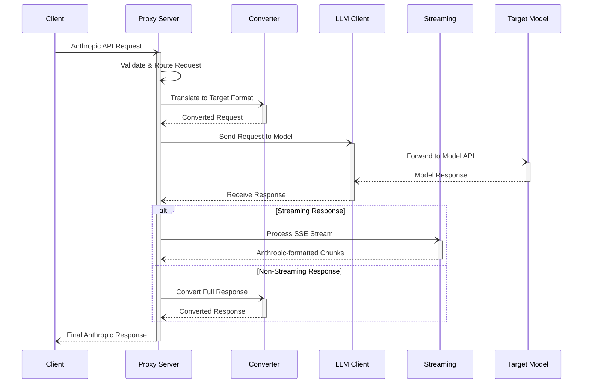

# Architecture

This document provides a high-level overview of the proxy's architecture.

## Core Components

The proxy is composed of several key components that work together to process and route API requests.

- **Proxy Server (`anthropic_proxy/server.py`)**: The main entry point of the application. It uses FastAPI to create a web server that listens for incoming Anthropic API requests. It handles request validation, sets up API keys, and delegates processing to other components.

- **Client (`anthropic_proxy/client.py`)**: Responsible for making outgoing requests to the underlying LLM APIs (e.g., OpenAI, Gemini). It uses `httpx` for asynchronous HTTP requests and handles the communication with the final API endpoint.

- **Converter (`anthropic_proxy/converter.py`)**: This component is responsible for translating the Anthropic API request format into the format expected by the target model (e.g., OpenAI or Gemini). It also converts the response back into the Anthropic format. This ensures seamless interoperability between different API standards.

- **Streaming (`anthropic_proxy/streaming.py`)**: Handles the complexities of streaming responses. It processes Server-Sent Events (SSE) from the target API and transforms them into the format expected by the Anthropic client.

- **Configuration (`anthropic_proxy/config.py`)**: Manages the application's configuration, including API keys, model mappings, and routing rules. It loads settings from environment variables and `models.yaml`.

- **Utilities (`anthropic_proxy/utils.py`)**: A collection of helper functions used across the application, such as token counting and error handling.

- **Types (`anthropic_proxy/types.py`)**: Defines the data structures and types used throughout the application, ensuring type safety and clarity.

## Request Flow

The diagram below illustrates the request/response lifecycle within the proxy.

**Lifecycle Steps:**

1.  **Request Initiation**: A **Client** sends an Anthropic-formatted API request to the **Proxy Server**.
2.  **Internal Processing**: The server validates the request, applies routing rules, and uses the **Converter** to translate it into the format expected by the **Target Model**.
3.  **Model Communication**: The **LLM Client** sends the converted request to the target model's API and receives a response.
4.  **Response Handling**:
    - For **streaming** responses, the **Streaming** component processes the Server-Sent Events (SSE) stream.
    - For **non-streaming** responses, the **Converter** translates the entire payload.
5.  **Final Response**: The **Proxy Server** sends the final, Anthropic-formatted response back to the **Client**.
